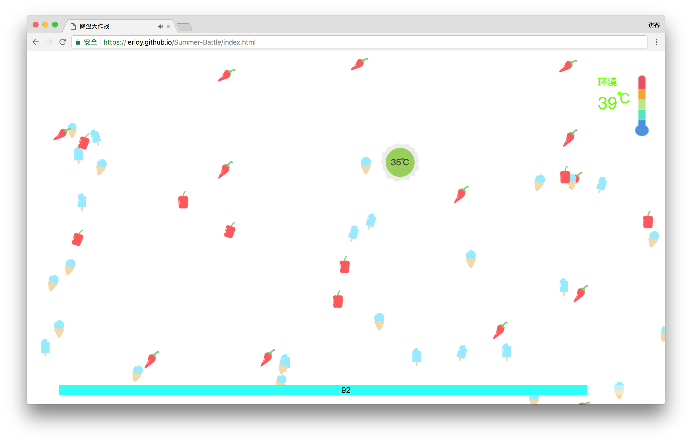
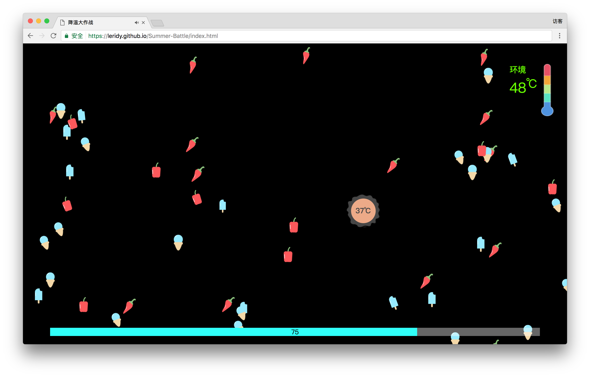
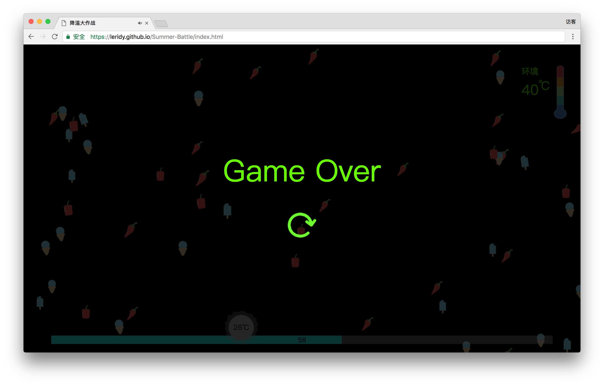

# Summer-Battle 降温大作战
via **小清凉 Team** @Unique Hackday2017

[demo->](https://leridy.github.io/Summer-Battle/login.html)

## Description
降温大作战是一款基于HTML5 的网页端轻游戏。炎炎夏日，每天的环境温度都会有先升后降的变化，游戏中我们需要在环境温度的基础上让自己所操控的角色吃冰淇淋降温解暑或吃辣椒升温，维持体温在正常范围内并度过一天（5min）即可顺利过关。

---
### 欢迎页
点击**Go**开始游戏，初始角色温度=环境温度（35℃），生命值100。过程中角色温度值=环境温度-累计吃冰淇淋数量+累计吃辣椒数量。

#### 温度规则：
- 35-37℃: 正常温度，心旷神怡～绿色
- 38-39℃ 或33-34℃: 异常提示，心率加速～角色颜色变橙/蓝绿，血量每秒-5
- 40-41℃ 或31-32℃: 角色颜色变红/蓝，血量每秒-10
- ≥42℃或≤30℃：休克->游戏结束

### 白天
白天环境温度上升，主要靠吃冰淇淋降温。

### 夜晚
夜晚环境温度降低，主要靠吃辣椒升温。

### 游戏结束

#### 结束规则
 1. 温度超出限定范围，休克；
 2. 血量减至0；
 3. 一天结束，成功过关。

